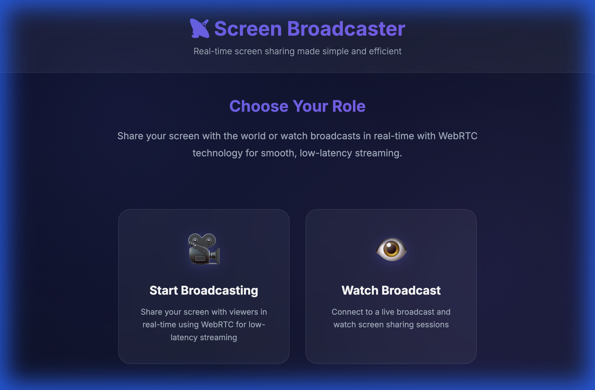
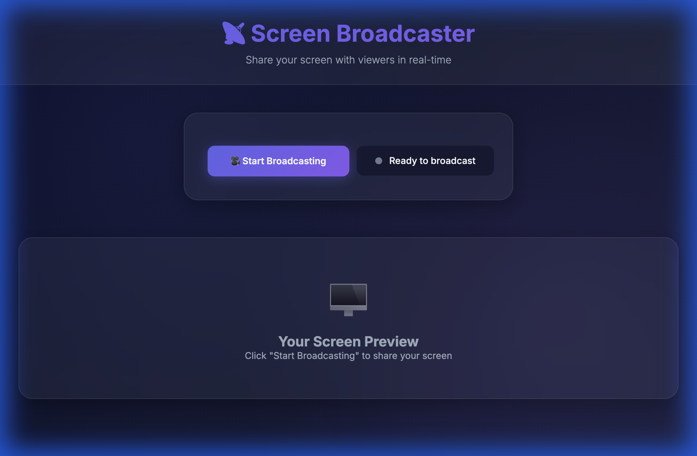
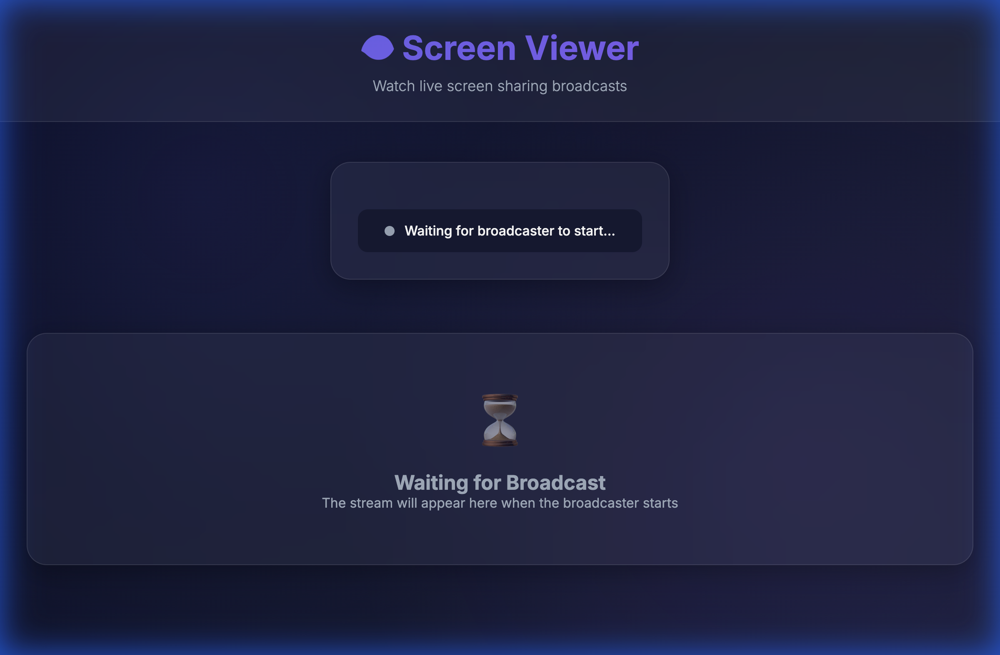

# Screen Broadcaster 📡

A clean and modern web-based screen sharing application built with WebRTC technology. Share your screen with multiple viewers in real-time with low latency and efficient bandwidth usage.

## Screenshots

### Home Page


### Broadcaster Interface


### Viewer Interface with Playback Controls


## Features

### Core Functionality
- **Real-time Screen Sharing**: WebRTC-based peer-to-peer streaming
- **Low Latency**: Uses UDP (via WebRTC's SRTP) for smooth, efficient streaming
- **Multiple Viewers**: Support for unlimited simultaneous viewers
- **Network Access**: Share across devices on the same Wi-Fi network
- **Secure**: End-to-end encrypted via DTLS-SRTP

### Viewer Controls
- **⏮️ / ⏭️ Frame Stepping**: Navigate frame-by-frame when paused
- **⏸️ Play/Pause**: Control video playback
- **🖼️ Picture-in-Picture**: Pop video into floating window
- **⛶ Fullscreen**: Full screen mode with auto-rotation on mobile
- **Responsive Layout**: Optimized for mobile and desktop

### User Experience
- **Modern Glassmorphic UI**: Sleek design with smooth animations
- **Auto IP Detection**: Server automatically finds your local network IP
- **One-Click Copy**: Easy sharing with copy-to-clipboard button
- **Mobile Optimized**: Controls adapt to screen size, auto-rotate to landscape

## Technology Stack

- **Backend**: Node.js + Express
- **Real-time Communication**: Socket.IO for signaling
- **Streaming**: WebRTC (uses UDP internally via SRTP)
- **Frontend**: Vanilla HTML/CSS/JavaScript

## Installation

1. Install dependencies:
```bash
npm install
```

2. Start the server:
```bash
npm start
```

Or for development with auto-reload:
```bash
npm run dev
```

3. Server will start and display:
```
Server running on:
  Local:   http://localhost:3000
  Network: http://192.168.100.102:3000

Share this URL for viewers on your network:
  http://192.168.100.102:3000/viewer.html
```

## Usage

### As a Broadcaster

1. Open `http://localhost:3000/broadcast.html` in your browser
2. Click **"🎥 Start Broadcasting"** button
3. Select the screen/window you want to share in the browser dialog
4. Click **"Share"** or **"Allow"** to grant permission
5. A **shareable viewer URL** will appear with a **📋 Copy** button
6. Share this URL with your audience
7. Monitor the **viewer count** in real-time
8. Click **"⏹️ Stop Broadcasting"** when done

### As a Viewer

1. Open the viewer URL shared by the broadcaster:
   - **Same device**: `http://localhost:3000/viewer.html`
   - **Network device**: `http://192.168.100.102:3000/viewer.html`
2. Wait for the broadcaster to start (if not already broadcasting)
3. Video will appear automatically once broadcast begins
4. Use playback controls to interact with the stream

### Viewer Controls

**Playback Controls (First Row):**
- **⏮️** Previous Frame - Step backward one frame (when paused)
- **⏸️ Pause / ▶️ Play** - Pause or resume the stream
- **⏭️** Next Frame - Step forward one frame (when paused)

**View Mode Controls (Second Row):**
- **🖼️ PiP** - Enter Picture-in-Picture mode (floating window)
- **⛶ Fullscreen** - Enter fullscreen mode
  - **Mobile**: Automatically rotates to landscape orientation

**Tips:**
- Pause the video to use frame-by-frame navigation
- PiP mode keeps video on top while you work in other apps
- Fullscreen provides immersive viewing, especially on mobile

## Network Access

### Accessing from Other Devices

The application supports **local network streaming**:

1. **Start broadcasting** on your main computer
2. **Get the network URL** displayed on the broadcaster page
3. **Share the URL** with viewers on the same Wi-Fi network
4. **Open the URL** on phones, tablets, or other computers

**Example URLs:**
- Local: `http://localhost:3000/viewer.html`
- Network: `http://192.168.100.102:3000/viewer.html`

### Troubleshooting Network Access

**Can't connect from another device?**

1. **Check firewall**: Ensure your Mac allows incoming connections on port 3000
   - Go to: System Settings → Network → Firewall
   - Allow Node.js or the broadcaster app

2. **Verify network**: Both devices must be on the **same Wi-Fi network**
   - Don't use VPN on either device

3. **Test connection**: From another device, try pinging the server:
   ```bash
   ping 192.168.100.102
   ```

## Architecture

```
┌─────────────┐         ┌──────────────┐         ┌─────────────┐
│ Broadcaster │◄───────►│    Server    │◄───────►│   Viewer 1  │
│  (Browser)  │  Socket │ (Socket.IO)  │  Socket │  (Browser)  │
└─────────────┘   .IO   └──────────────┘   .IO   └─────────────┘
      │                                                   ▲
      │              WebRTC P2P Connection                │
      └───────────────────────────────────────────────────┘
                    (Direct Media Stream)
```

### Why WebRTC?

WebRTC was chosen because it's the **optimal solution** for real-time browser-based streaming:

1. **UDP-based Media Transport** - Uses UDP internally for minimal latency
2. **Peer-to-Peer Architecture** - Direct streams reduce server load
3. **Security Built-in** - Mandatory encryption (DTLS-SRTP)
4. **Browser Native** - Works in all modern browsers without plugins

## Browser Support

- Chrome/Chromium 74+
- Firefox 66+
- Safari 12.1+
- Edge 79+

**Mobile Browsers:**
- Chrome Mobile (Android)
- Safari (iOS)
- Firefox Mobile

## Configuration

The application uses public STUN servers by default. For production use, consider:

- **TURN servers**: Better connectivity through restrictive firewalls
- **Authentication**: Implement user authentication for broadcasters
- **Room system**: Multiple independent broadcast rooms
- **Recording**: Save broadcasts server-side
- **Chat**: Real-time viewer chat functionality
- **Quality controls**: Bandwidth and resolution settings

## Features Comparison

| Feature | Description | Status |
|---------|-------------|--------|
| Screen Sharing | Share your screen in real-time | ✅ |
| Multiple Viewers | Unlimited simultaneous viewers | ✅ |
| Network Access | Share across local network | ✅ |
| Playback Controls | Pause, play, frame stepping | ✅ |
| Picture-in-Picture | Floating window mode | ✅ |
| Fullscreen | Full screen with auto-rotate | ✅ |
| Mobile Optimized | Responsive controls | ✅ |
| Viewer Count | Real-time viewer tracking | ✅ |
| Auto IP Detection | Automatic network URL | ✅ |
| Copy to Clipboard | Easy URL sharing | ✅ |

## License

MIT
